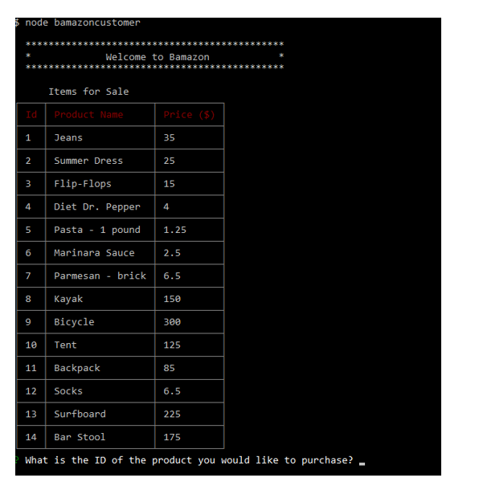
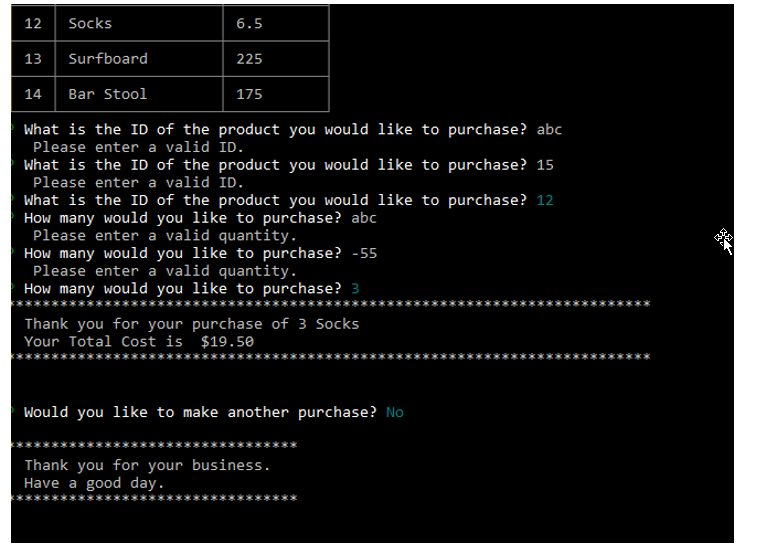
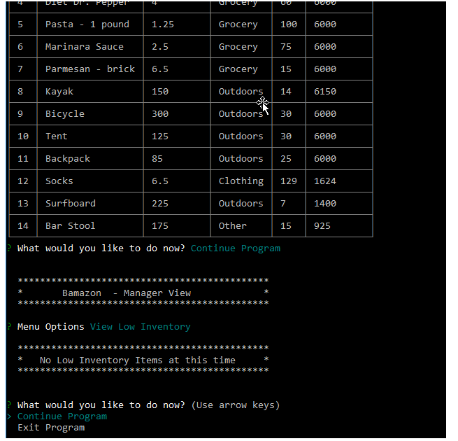
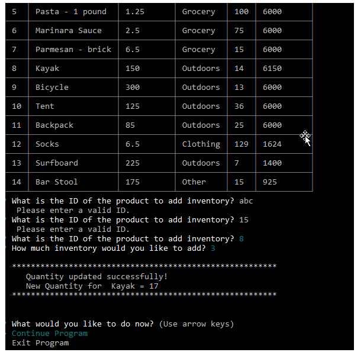
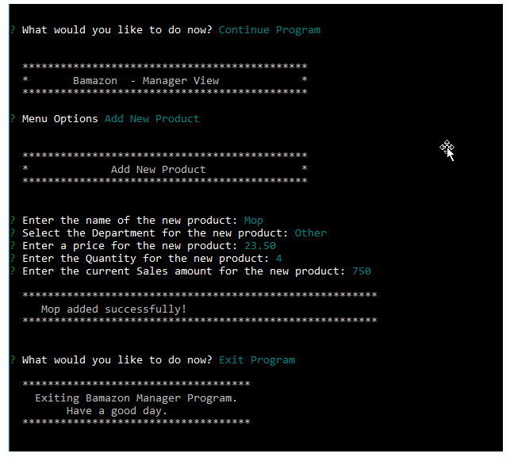
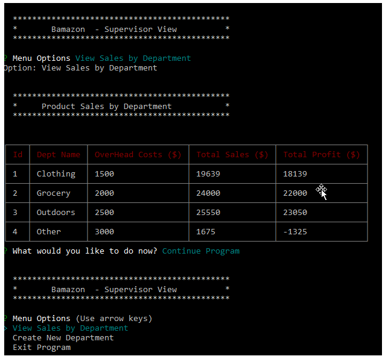
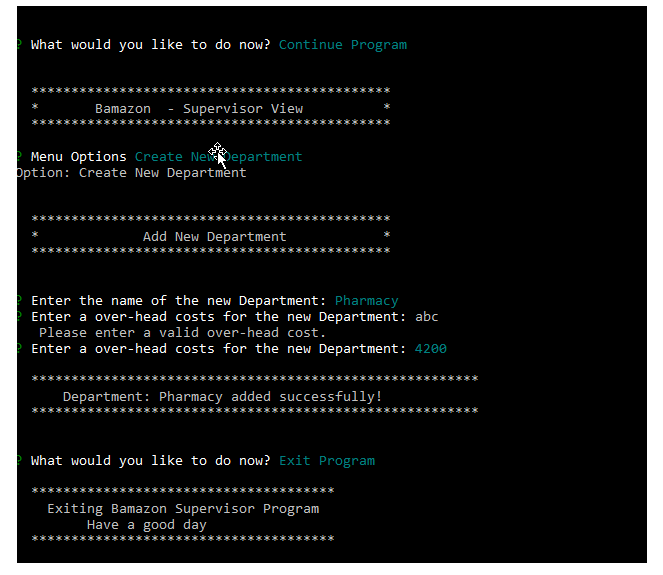

# bamazon
Rhonda Johnson

## Overview

Bamazon is an Amazon-like storefront.  The app will take in orders from customers and deplete stock from the store's inventory. The app will track product sales across the store's departments and then provide a summary of the profits by department.

# Link to deployed project
https://rmxjohnson.github.io/bamazon/

# Built with:
 * Node.js
 * MySQL 
 * NPM packages:  mysql, inquirer, cli-table

# Tables in bamazon database

products table:

   * item_id (unique id for each product)
   * product_name (Name of product)
   * department_name
   * price (cost to customer)
   * stock_quantity (how much of the product is available in stores)
   * procduct_sales (total sales for the product)

departments table:

   * department_id (unique id for each department)
   * department_name
   * over_head_costs 

## Synopsis of each Module

# bamazonCustomer.js

1. On entry, the app displays all items available for sale

2. The app prompts users with two messages. 
   * First mesage - asks them the ID of the product they would like to buy (validation of user input)
   * Second message - asks how many units of the product they would like to buy (validation of user input)

3. Once the customer has placed the order, the app checks if the store has enough of the product to meet the customer's request. If not, the user is notified and the order does not process.

4. However, if your store has enough of the product, the customer's order is fulfulled.
   * The products table is updated to reflect the modified stock_quantity and product_sales values
   * The customer is notified of the total cost of their purchase
   * The customer is prompted if they would like to make another purchase or exit the program

# bamazonManager.js

1. On entry, the user is given a set of menu options:

    * View Products for Sale    
    * View Low Inventory    
    * Add to Inventory    
    * Add New Product
    * Exit Program

  * `View Products for Sale` - lists every available item: the item IDs, names, prices, and quantities
  * `View Low Inventory`-  lists all items with an inventory count lower than five. (minimum can be configured)
  * `Add to Inventory` - displays a prompt that will let the manager "add more" of any item currently in the store
  * `Add New Product` - allows the manager to add a new product to the store (validation of user input)
  * `Exit Program` - allows the manager to exit the program 

2. After an option is completed, the manager is prompted whether they want to continue or exit the program

# bamazonSupervisor.js

1. On entry, the user is given a set of menu options:

   * View Product Sales by Department   
   * Create New Department

2. `View Product Sales by Department` - displays a summarized table - department_id, department_name, over_head_costs, product_sales, total_profit

3. `product_sales` & `total_profit` columns are not stored in the database but are calulated when needed

4. `Create New Department` - allows the user to add a new department to the store (validation of user input)

## Screenshots

# bamazonCustomer.js
1. Product table displayed and user prompt

2. User prompts (with validation), total cost of purchase, continue prompt, exit message

# bamazonManager.js
1. Product table displayed, user prompt, view low inventory (none < 5), continue prompt

2.  Add inventory prompts (with validation), success message, continue prompt

3. Add new product prompts, success message, continue prompt, exit message

# bamazonSupervisor.js
1. User prompts, View Sales by department (table displayed with correct values), continue prompt, menu options

2.  Add new department, prompts (with validation), success message, continue prompt, exit message

